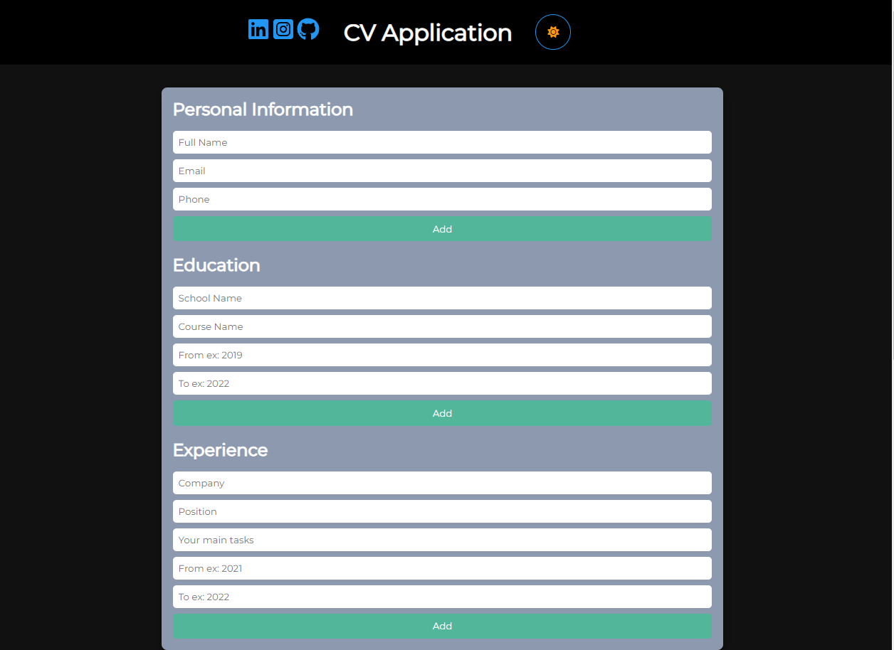
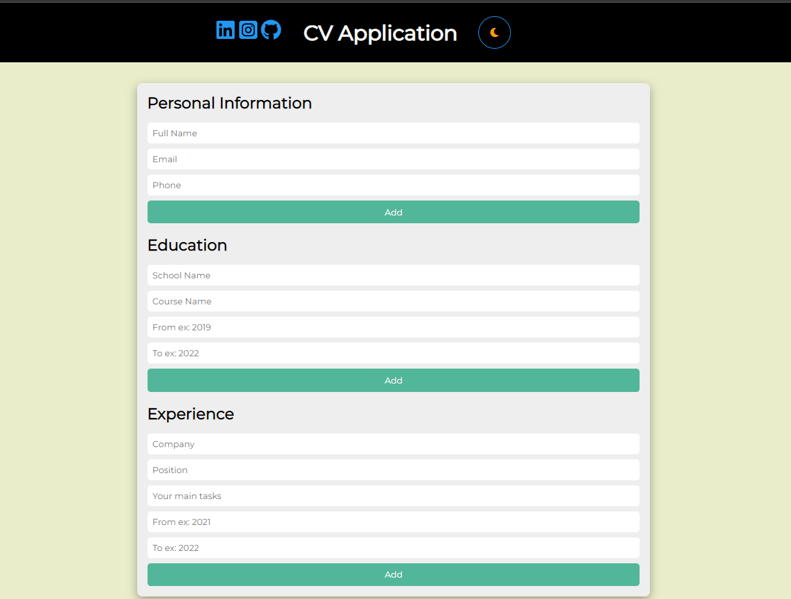
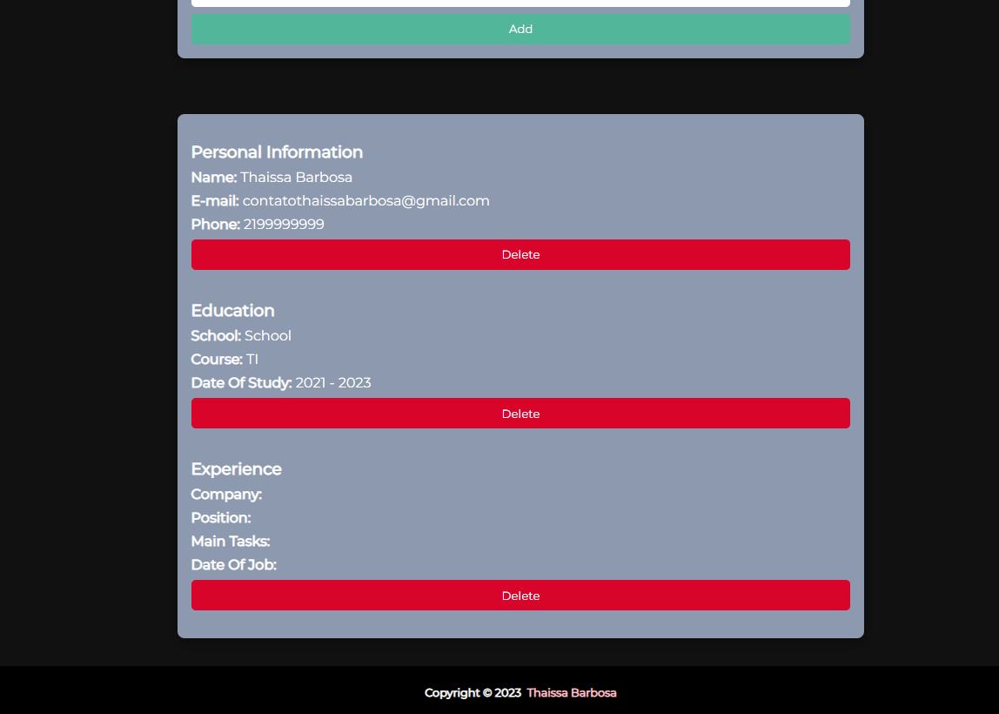

 
 <h1 align="center">CV-Aplication</h1>

 <a href="#-layout">Layout  |</a> 
 <a href="#-tecnologia">Technology |</a> 
 <a href="#-project">Project |</a> 
 <a href="#memo-liceça">License</a> 

## 🎨 Layout

 
 
 

## 🚀 Tecnologias

This project was developed with the following technology:

- React.JS
- Styled Components
- JavaScript
- Node.JS
- Git and Github

## 💻 Project

This application has:

- A section to add general information like name, email, phone number.
- A section to add your educational experience (school name, title of study, date of study).
- A section to add practical experience (company name, position title, main tasks of your jobs, date from and until when you worked for that company).

Live preview: https://my-first-ecommerce-baby.netlify.app/

## :memo: Licença

This project is under the MIT license

 

Made with 💜 by myself : [My contact!] [contatothaissabarbosa@gmail.com]
